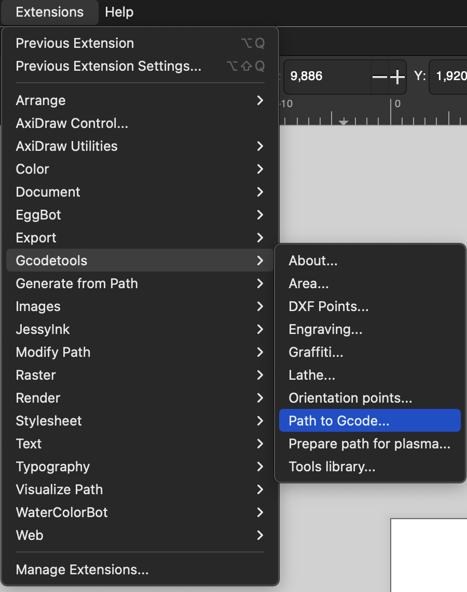
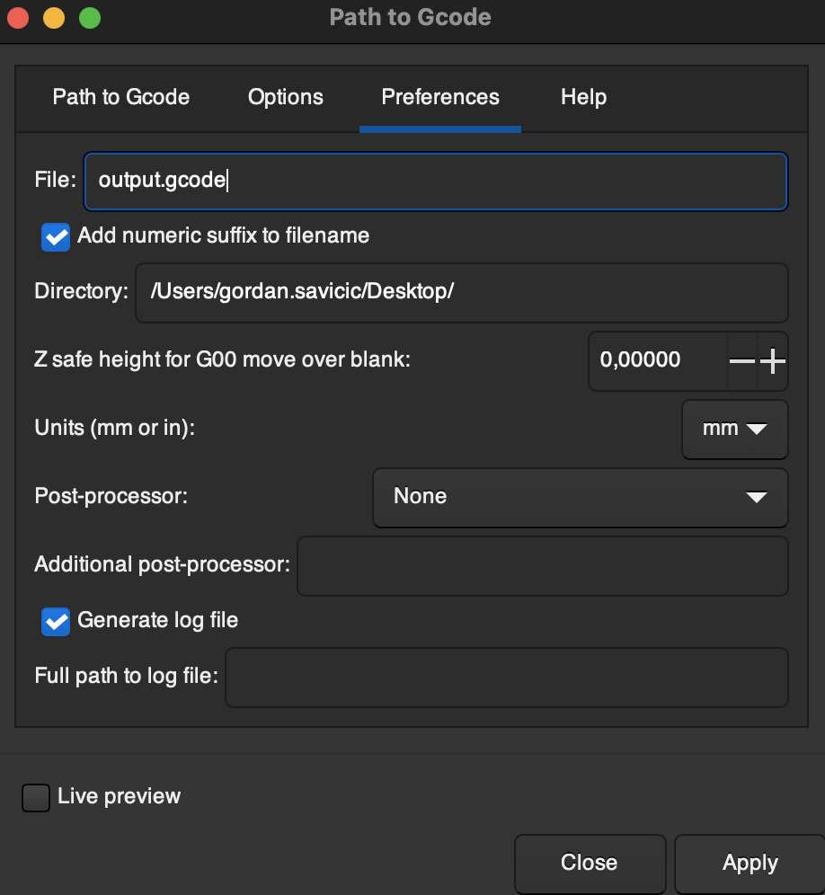
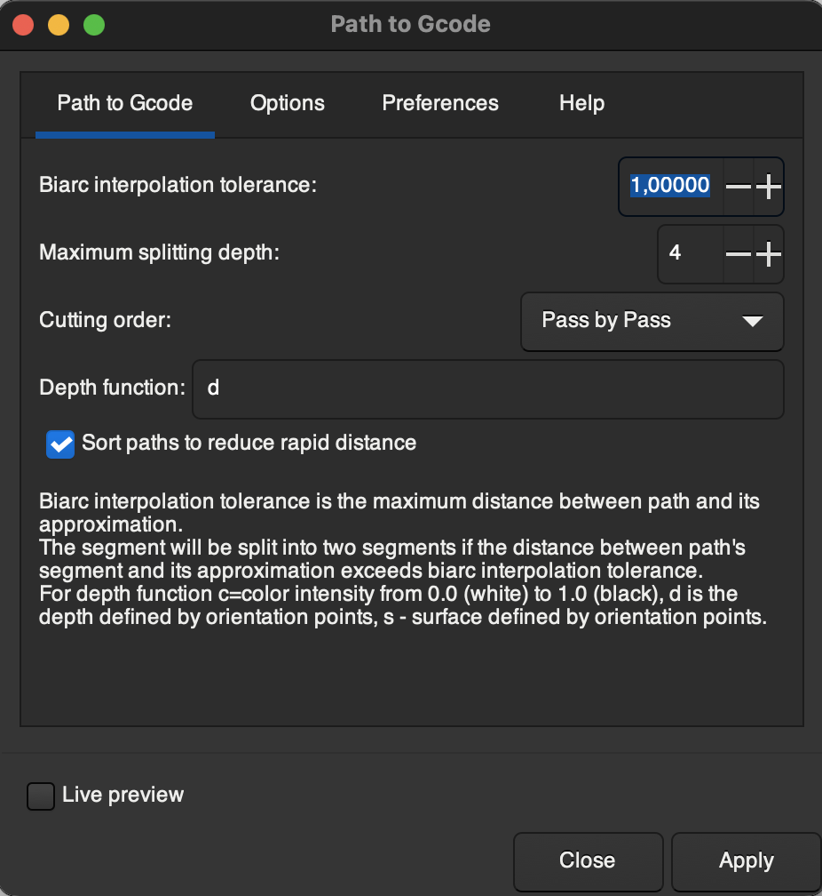

# GRBL

## Quickstart

   - [Download ZIP](https://github.com/gnea/grbl/releases) from GRBL Repo (v1.1)
   - Open Arduino IDE. Select Sketch -> Include Library -> Add .zip library
   - In Arduino IDE, open Examples -> grbl -> grbl upload
   - Upload the sketch to the Arduino
   - Download [desktop app cncJS](https://cnc.js.org/docs/desktop-app/) 
   - Read the [cncJS user guide](https://cnc.js.org/docs/user-guide/) for more infos

## Vector Drawing to gcode

[Inkscape](https://inkscape.org/) (an open-source alternative to Adobe Illustrator) has a built-in plugin called Gcodetools which is basically a python script that converts your vector drawing in machine code that you can later use with cncjs and grbl.

Instruction on how to use it are [here](https://all3dp.com/2/inkscape-g-code-all-you-need-to-know-to-get-started/)

The generated gcode file can't be read with cncjs because of the % sign character that is present on the first and second line. Either you can delete these two lines by hand or use the commandline with following command:

```
sed -i '' '/%/d' output.gcode
```

In Inkscape convert objects to paths, then open the Gcodetools extension as described below. Click Apply when in tab "Path to Gcode". 





