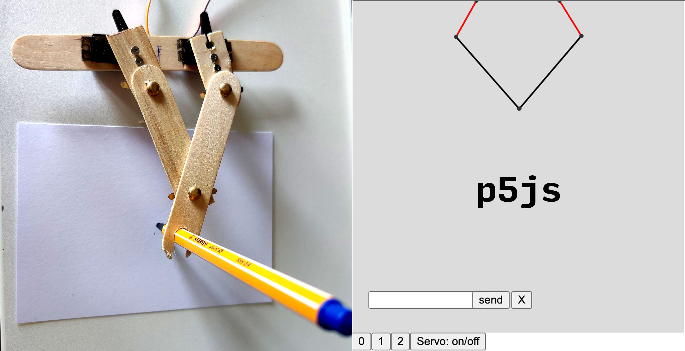
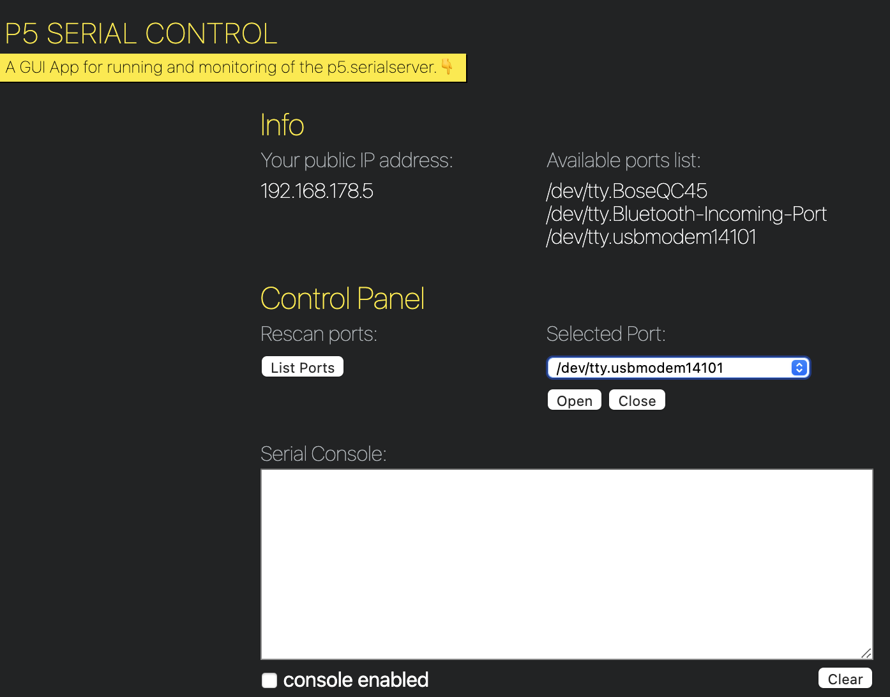
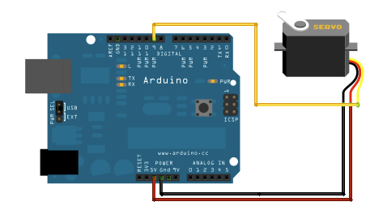

# Stepperbot - 5-Bar Linkage Drawing Robot



A drawing robot with two stepper-driven arms using inverse kinematics to draw in a cartesian coordinate system. Based on a [Five-bar linkage](https://en.wikipedia.org/wiki/Five-bar_linkage) mechanism. Coordinates are sent via serial port from a p5.js web interface.

## 5-Bar Linkage Configuration

### Physical Parameters (Configure in sketch.js)

```javascript
let armLength = 115;   // Length of the moving arm segments (in mm or px)
let baseLength = 50;   // Distance between base pivot points (in mm or px)
```

**How to measure your robot:**
- `armLength`: Measure from the stepper motor axis to the end effector joint
- `baseLength`: Measure the distance between the two stepper motor axes

### Workspace Calculation
The reachable workspace is determined by:
- **Maximum reach**: `2 × armLength - baseLength` 
- **Minimum reach**: `baseLength`
- **Optimal workspace**: Center region where both arms have good mechanical advantage

With default settings (armLength=115, baseLength=50):
- Max reach: `2 × 115 - 50 = 180` units
- Min reach: `50` units

## Software 

p5js sketch.js uses several custom classes to calculate position/angle of the robotic arms.

* segment.js 
* arm.js
* shapes.js

## Hardware Required

* Arduino Board (Uno, Nano, etc.)
* CNC Shield (e.g., Arduino CNC Shield V3)
* 2 x Stepper Motors (NEMA 17 recommended, 200 steps/rev)
* 2 x Stepper Drivers (A4988 or DRV8825)
* 12V Power Supply (2A minimum)
* Mechanical linkage parts (wood sticks, fasteners, bearings)
* USB Cable for serial communication
* Hook-up wires

### Stepper Motor Setup
- **Left Stepper**: CNC Shield slot Y (STEP=3, DIR=6)
- **Right Stepper**: CNC Shield slot X (STEP=2, DIR=5)  
- **Enable Pin**: Pin 8 (SLEEP for both drivers)
- **Microstepping**: Set to 1/4 step (MS1=HIGH, MS2=HIGH, MS3=LOW on A4988)

## Quickstart

### 1. Hardware Setup
  - Mount stepper motors to CNC shield:
    - Left motor → Y slot (pins 3, 6)
    - Right motor → X slot (pins 2, 5)
  - Connect 12V power supply to CNC shield
  - Set microstepping jumpers on A4988 for 1/4 step mode
  - Connect Arduino to computer via USB

### 2. Arduino Setup
  - Upload `99_Stepperbot.ino` to Arduino
  - Open Serial Monitor (9600 baud) and verify connection
  - Type `?` to see help menu
  - Test with: `X50,Y50` (should move both steppers)

### 3. Serial Server Setup
  - Set Node.js to compatible version:
    ```bash
    nvm use 12.20.2
    ```
  - Navigate to serialserver directory:
    ```bash
    cd serialserver
    node startserver.js
    ```
  - Server should start on default WebSocket port

### 4. Web Interface Setup
  - **IMPORTANT**: Find your Arduino's serial port:
    - **macOS**: `/dev/cu.usbserial-XXXX` or `/dev/cu.usbmodem-XXXX`
    - **Windows**: `COM3`, `COM4`, etc.
    - **Linux**: `/dev/ttyUSB0` or `/dev/ttyACM0`
  
  - Update port in [sketch.js](js/sketch.js#L40):
    ```javascript
    serial.open("/dev/cu.usbserial-1110", {baudRate: 9600});
    ```
  
  - Start a local web server:
    ```bash
    python3 -m http.server 8000
    # or
    npx serve .
    ```
  
  - Open browser: `http://localhost:8000/index.html`
  - Open browser console (F12) to check for errors
  - Click "on/off" button to enable stepper control

### 5. Calibration
  - Use mode buttons (0, 1, 2) to test different patterns:
    - **Mode 0**: Mouse follow (manual control)
    - **Mode 1**: Square path
    - **Mode 2**: Circle path
  - Adjust `armLength` and `baseLength` in sketch.js to match your physical setup
  - Add custom shapes in [shapes.js](js/shapes.js)
  


## Circuit

Servo motors have three wires: power, ground, and signal. The power wire is typically red, and should be connected to the 5V pin on the Arduino board. The ground wire is typically black or brown and should be connected to a ground pin on the board. The signal pin is typically yellow, orange or white and should be connected to pin 9 on the board. Second servo is connected to pin 10.



(Images developed using Fritzing. For more circuit examples, see the [Fritzing project page](http://fritzing.org/projects/))

## Schematic


## p5.serial Setup & Troubleshooting

### Initial Setup

The p5.serial library requires **Node.js v12.x** due to native serialport bindings:

```bash
# Install Node Version Manager (if not already installed)
curl -o- https://raw.githubusercontent.com/nvm-sh/nvm/v0.39.0/install.sh | bash

# Install and use Node.js 12.20.2
nvm install 12.20.2
nvm use 12.20.2

# Install required packages globally
npm install serialport -g
npm install ws -g
npm install p5.serialserver --unsafe-perm -g
```

### Running the Serial Server

```bash
cd serialserver
node startserver.js
```

Expected output:
```
p5.serialserver is listening on port 8081
```

### Common Issues & Solutions

#### ❌ Serial port not found
**Problem**: Cannot connect to Arduino

**Solution**:
1. List available ports:
   ```javascript
   // Uncomment in sketch.js setup():
   serial.list(listPorts);
   ```
2. Check browser console for port list
3. Update `serial.open()` with correct port
4. On Mac, use `/dev/cu.*` not `/dev/tty.*`

#### ❌ Permission denied (Linux/macOS)
**Problem**: `Error: Permission denied, cannot access /dev/ttyUSB0`

**Solution**:
```bash
# Add user to dialout group (Linux)
sudo usermod -a -G dialout $USER
# Log out and back in

# Or change permissions (temporary)
sudo chmod 666 /dev/ttyUSB0
```

#### ❌ Connection timeout
**Problem**: Serial connection established but no data

**Solution**:
1. Verify Arduino is running (LED should blink on upload)
2. Test with Arduino Serial Monitor first
3. Close Serial Monitor before connecting p5.serial
4. Check baud rate matches (9600)
5. Add delay in Arduino setup:
   ```cpp
   void setup() {
     Serial.begin(9600);
     delay(1000); // Wait for serial
   }
   ```

#### ❌ Steppers jitter or don't move
**Problem**: Movement is erratic or steppers just vibrate

**Solution**:
1. **Check angle-to-steps conversion**: The Arduino code currently treats incoming angles as raw step values. This may cause unexpected behavior.
2. **Verify microstepping**: Code expects `MICROSTEPS 4`, check jumpers
3. **Check current limit**: Adjust A4988 potentiometer (see main StepperIntro)
4. **Reduce speed**: Lower `RPM` from 60 to 30 in Arduino code
5. **Check wiring**: Ensure coil pairs are correctly connected

### Alternative: Web Serial API (Modern Browsers)

For Chrome/Edge (no Node.js server needed):

```javascript
// Replace p5.serialport with Web Serial API
let port;

async function connectSerial() {
  port = await navigator.serial.requestPort();
  await port.open({ baudRate: 9600 });
}
```

*Note: This requires updating the codebase to use Web Serial API instead of p5.serialport*

### References
- [p5.serialserver GitHub](https://github.com/p5-serial/p5.serialserver)
- [p5.serialport Documentation](https://github.com/p5-serial/p5.serialport)