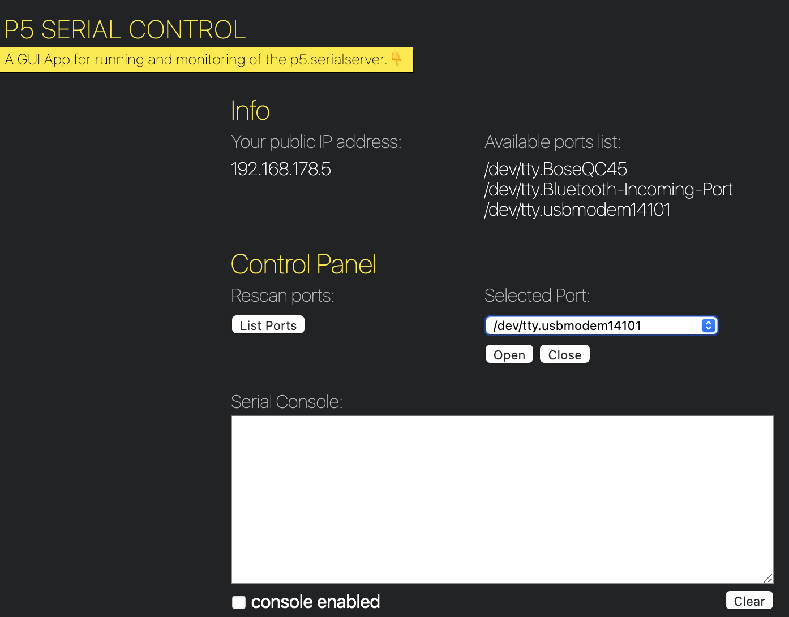

# Simple draw bot


Simple bot with two arms that uses inverse kinematics to calculate angle for a cartisian grid system. Coordinates are sent via serial port. You'll need to run [p5serialport](https://github.com/p5-serial/p5.serialcontrol/releases) and connect the right port for the Arduino. Read more about the mechanics behind this on [Five-bar-linkage](https://en.wikipedia.org/wiki/Five-bar_linkage).

## Software 

p5js sketch.js uses several custom classes to calculate position/angle of the robotic arms.

* segment.js 
* arm.js
* shapes.js

## Hardware Required

* Arduino Board
* 2 x Servo Motors
* Bastelhölzer, Musterbeutelklammern ()
* Hook-up wires

## Quickstart

  - Upload ino file to arduino
  - Connect mini-servos to port (9, 10). +5V are taken from Arduino (bit risky in case of higher currents - better to switch to external power supply)
  - ~~Install [p5serialport](https://github.com/p5-serial/p5.serialcontrol/releases), open software, select port and connect~~ Read more on p5.serial
  - Start liveserver on your desktop and open index.html
  - Modify your USB port if necessary in sketch.js ```serial.open("/dev/tty.usbmodem14101");```
  - Open browser and navigate to http://127.0.0.1:5555/index.html
  - Open inspector, check error log
  - Remix mix and add more drawing shapes to shapes.js
  


## Circuit

Servo motors have three wires: power, ground, and signal. The power wire is typically red, and should be connected to the 5V pin on the Arduino board. The ground wire is typically black or brown and should be connected to a ground pin on the board. The signal pin is typically yellow, orange or white and should be connected to pin 9 on the board. Second servo is connected to pin 10.


(Images developed using Fritzing. For more circuit examples, see the [Fritzing project page](http://fritzing.org/projects/))

## Schematic


## p5.serial

Run p5.serial server

put node into an old version where p5 serial bindings where still working...
```
nvm use 12.20.2
```

```
npm install serialport -g
npm install ws -g
npm install p5.serialserver --unsafe-perm -g
```

```
cd serialserver
node startserver.js
```

Or try from here https://github.com/p5-serial/p5.serialserver